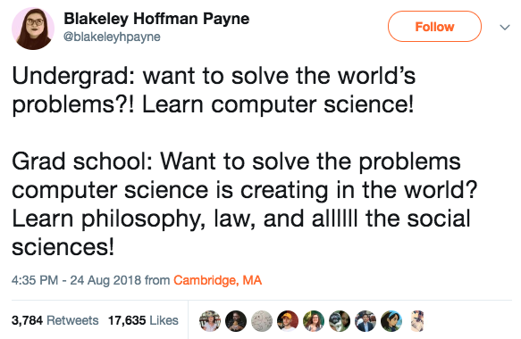

I advocate that the industry should consider including the legal engineering role in some development teams.  A recent tweet crossed my feed earlier this week reminding me why.

Then the first reply gets to my rationale behind the new legal engineer role (somewhat orthogonally):

Let me explain.

Computer science is agnostic about the subject matter.  Whether you're building a game, a social network, a supply chain management system, a self driving car, or a new token-based economy, computer science helps us design it correctly and efficiently.

But as the products of computer scientists reached massive global adoption over the past decade, we've witnessed all kinds of problems popping up... societal, political, ethics, legal, racism, and much more.  As software has entered most of our daily lives, every human problem has has also manifested itself in the products built by computer scientists.  These are problems they don't teach solutions for in core computer science curriculum.

Thus my strong belief, based on years of experience with dozens and dozens of teams, is that a software engineering team needs a diversity of skills and considerations; and the legal engineer may be a critically important one for some teams.
